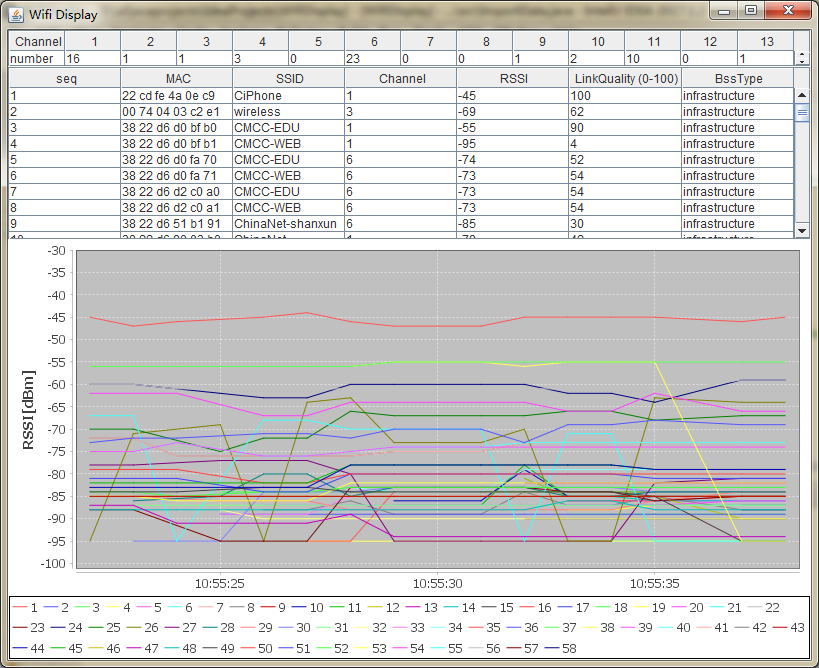
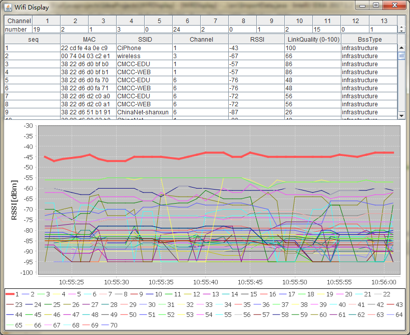
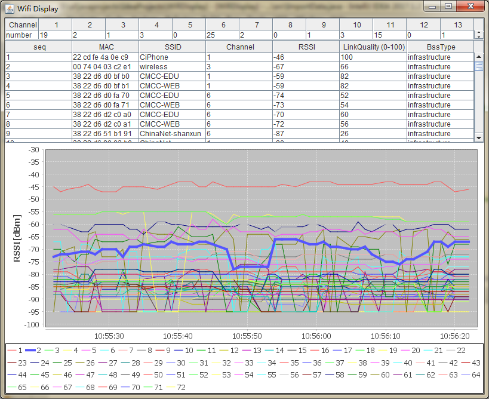
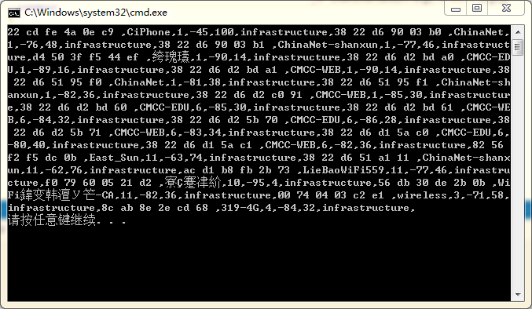

# WiFiMonitor
WiFiMonitor is able to monitor all wifi around in Windows.  
It can display information like SSID, RSSI, BSSID etc, and draw the curve of wifi signal.  
This application is based on [Windows Native Wifi](https://docs.microsoft.com/zh-cn/windows/desktop/NativeWiFi/portal) and [jfreechart](http://www.jfree.org/jfreechart/).
## Usage
1. place `WifiDisplay.jar` and `WifiScan.exe` in the same directory
2. run `java -jar WifiDisplay.jar` (need jre)
## ScreenShot
- Normal Display  

- Choose specific wifi  

- Choose specific wifi  

- The Output of WifiScan  
